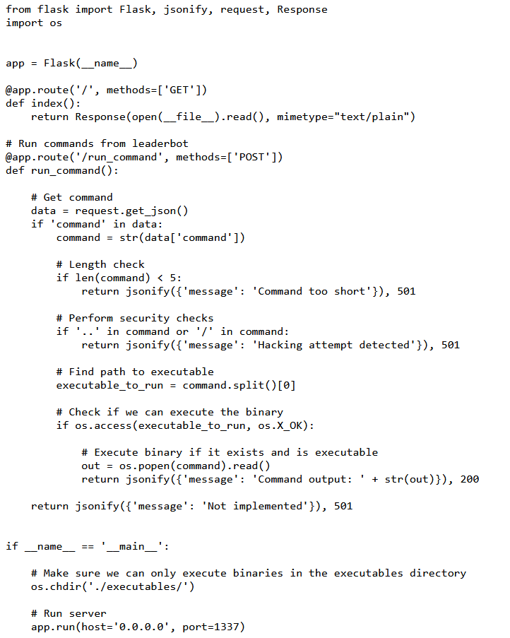

https://battle.cookiearena.org/challenges/web/empty-execution

1.	Phân tích nguồn code 

-	Route chạy lệnh từ leaderbot thông qua HTTP POST với path là /run_command, dữ liệu từ request phải là dạng json nên ta cần thêm header content-type và body dạng json

- Điều kiện để chạy lệnh đầu tiên kiểm tra xem có chưa command không nếu có thì chuyển thành chuỗi và kiểm tra độ dài nếu dưới 5 kí tự sẽ không thực thi và có nội dung như hình 

Nếu trong command chứa các dấu '..' or '/' thì trả về như hình

-	Khi đã thỏa mãn các điều kiện trên thì xét đến tách lệnh đầu tiên và kiểm tra xem có tồn tại và quyền thực thi trong thư mục executable hay không
-	Nếu không hợp lệ thì trả về định dạng dưới 

-	Nếu hợp lệ sẽ trả về chuỗi giá trị sau khi thực hiện lệnh command

2.	Bắt đầu lấy FLAG

Do command sẽ lấy lệnh đầu tiên để kiểm tra có phải binary có trong thư mục executable hay không rồi mới thực thi lệnh

-	Ta sử dụng lệnh dot: lệnh . (dot command) trong shell để bypass các bộ lọc 
-   Search  được cú pháp 
{“command”: “cat $(echo <đường dẫn>)”} dạng json 
dùng backtick $(command injection): thực hiện lệnh con sau đó kết quả sẽ là cho lệnh phía trước 

-	Tuy nhiên payload chưa hoàn toàn bypass được đầu vào do câu lệnh đầu tiên không phải binary trong thư mục executable nên ta cần hoàn thiện bằng cách thêm dot command:
    - {
    "command": ". ;cat $(echo L2ZsYWcudHh0 | base64 -d)"
}

Kết quả ta lấy được flag:
    

3.	Kinh nghiệm:
- Nếu đầu vào lấy lệnh đầu tiên mà bắt buộc phải trong một thư mục chỉ định 
ví dụ các tệp chương trình thực thi được lưu trữ trong thư mục executables/ trên hệ thống.
ta sử dụng dot command để bypass
