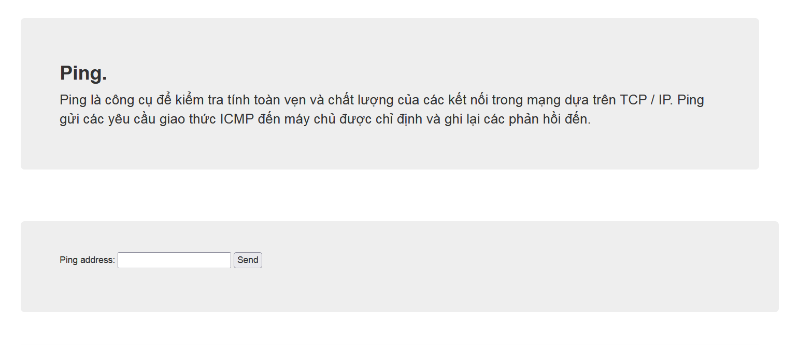
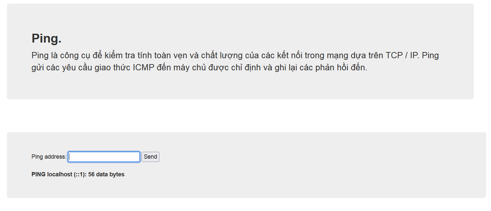
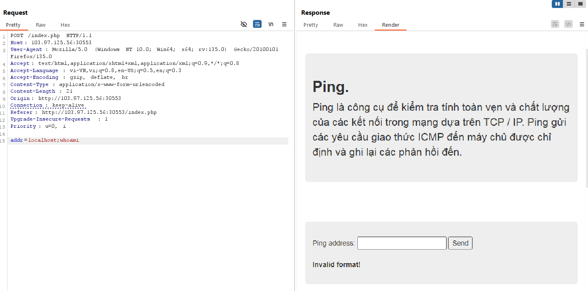
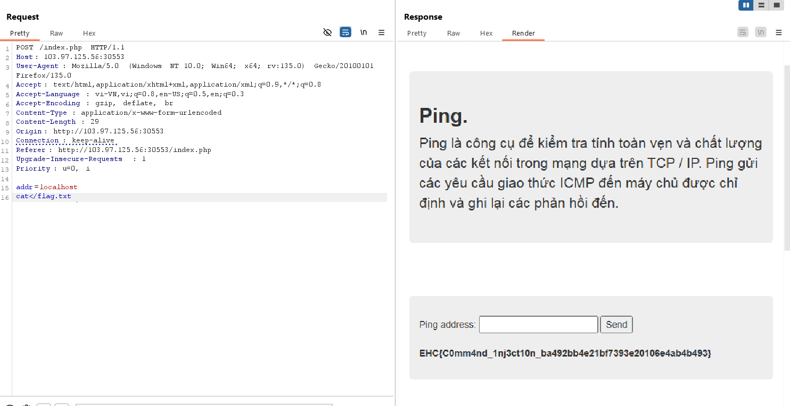

https://battle.cookiearena.org/challenges/web/ethical-ping-pong-club

- Ta thấy giống một bài command injection thông thường với lệnh ping, sử dụng ping localhost xem có điều gì xảy ra

- Chưa thấy gì đặc biệt nhưng ta nhận thấy http request trong burpsuite có hiện tham số addr = localhost, khả năng ta sẽ tiêm command vào trong tham số 

- ta thử với các kí tự đặc biệt như ; %26 tương đương với & , && , || , > đều ko được chứng tỏ web đã fill hết tất cả các trường hợp đặc biệt
nên ta sẽ dùng PayLoadAllTheThings
để vượt qua ta thử và sử dụng cat</flag.txt

- đã lấy được Flag. Lưu ý là ta cần phải thử hết các thức bypass 
Input redirection. The < character tells the shell to read the contents of the file specified. Kí tự này để chuyển yêu cầu đọc nội dung của tệp được chỉ định
