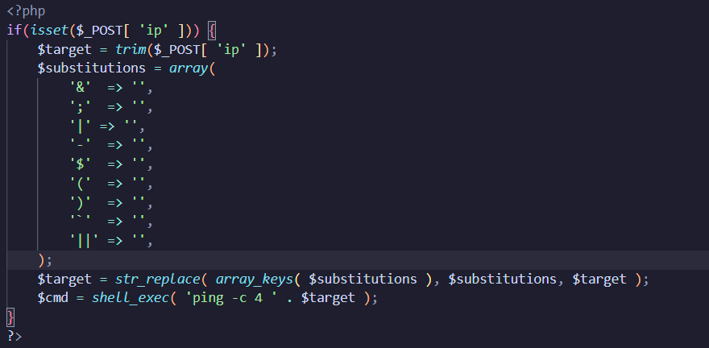
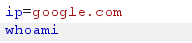
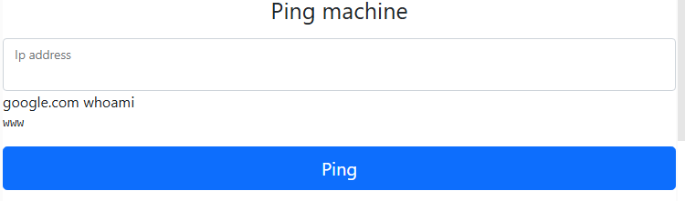
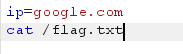
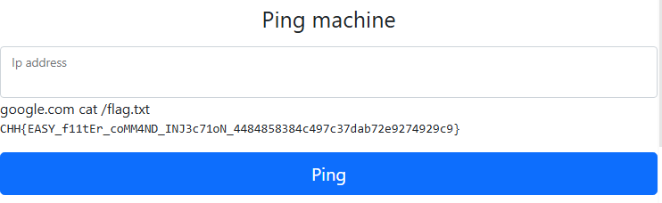

https://battle.cookiearena.org/challenges/web/ping-0x01

1.	Phân tích nguồn source

- web lấy địa chỉ ip bằng phương thức POST sau đó sẽ lọc các toán tử thành khoảng trắng để tránh command injection
- tiếp theo dùng lệnh command shell là shell_exec để ping với giới hạn là 4 gói tin
  
2.	Tìm flag
-	Do mã nguồn đã filter hết các toán tử nhưng vẫn còn trường hợp xuống dòng để thực hiện thêm một lệnh khác
-	Ta sẽ sử dụng burp repeater để nhập giá trị vào tham số ip với payload sau 

- giá trị whoami đã được trả về chứng tỏ lệnh đã được thực thi,	ta tiêm payload để lấy FLAG

