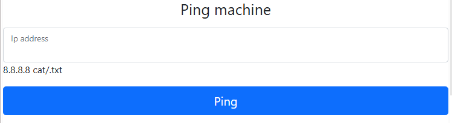
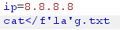

https://battle.cookiearena.org/challenges/web/ping-0x02

1.	Phân tích code source

-	Web sử dụng phương thức POST để nhận địa chỉ ip, sau đó địa chỉ ip được thực hiện bằng lệnh command shell shell_exec 
-	Web đã filter hết các toán tử và backtick nhưng chưa filter dấu xuống dòng nên ta sẽ thử nhập 2 giá trị vào giá trị ip

2.	Bắt đầu lấy FLAG
-	Mở burpsuite và gửi http request vào burp repeater
-	Ta thử với payload: 

 

- Có thể bypass với xuống dòng giờ ta sẽ thử payload để xem kết quả trả về 

- Nhận ra cả flag với khoảng trắng đều bị filter ta cần bypass cả khoảng trắng
- Payload bây giờ của ta sẽ có dạng 
  
  

    sở dĩ viết payload như vậy vì ta nghĩ khi ; chuyển thành '' và khi đó sẽ giữ lại cụm ‘flag’
    Dấu <: Đây là redirection operator (toán tử chuyển hướng đầu vào) trong shell, dùng để thay đổi nguồn đầu vào tiêu chuẩn (stdin) của lệnh cat
    
- Ta kiểm tra kết quả

 (bị filter hết =))))

-	Vậy ko bypass bằng cách thêm toán tử vào trong cụm từ flag được ta sẽ chuyển sang thêm cặp dấu '' vào cụm từ flag, payload của ta như sau

