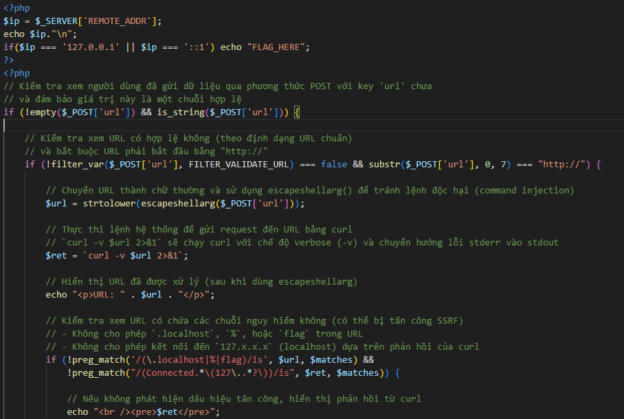
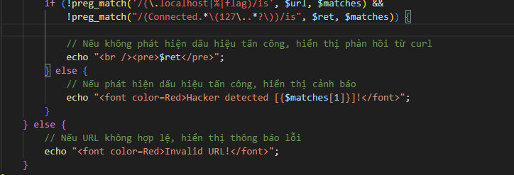
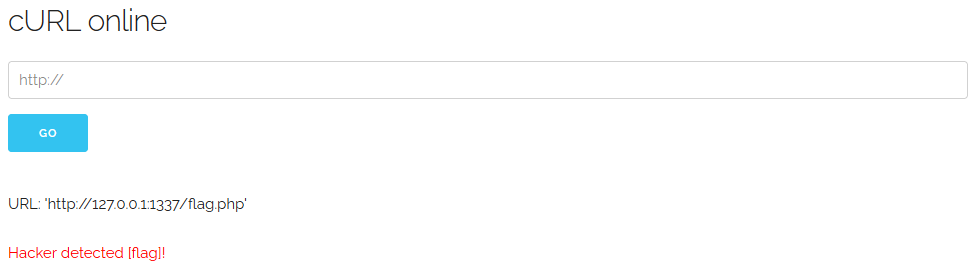
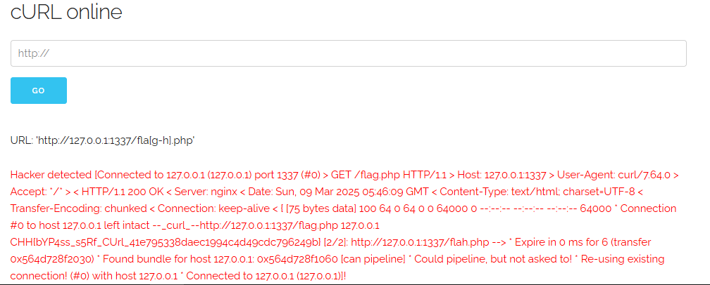

https://battle.cookiearena.org/challenges/web/svattt-2016-quals-curl

1.	Phân tích file flag.php và idex.php

-	Với file flag.php thì ta cần lưu ý rằng ta chỉ lấy được flag khi địa chỉ ip ta điền vào là 127.0.0.1:1337
-	Với file idex.php thì lại có hàm escapeshellarg($_POST['url']) để thực hiện lệnh shell
điều kiện để hiển thị 

(Hàm này chỉ hiển thị rằng có phải hacker detect hay không mà không ngăn chặn tức là xử lí đầu vào nên khi ta đã truy cập được vào 127.0.0.1 thì ta hoàn toàn có thể hiển thị ra file flag với màu chữ là đỏ =)))

2.	Bắt đầu lấy flag

-	Thử với payload http://127.0.0.1:1337/flag.php

- Có chữ flag trong http nên ta cần pypass nó, có một cú pháp để pybass khi search trên mạng 
https://curl.se/docs/CVE-2016-8624.html 
Curl không phân tích chính xác thành phần authority của URL khi phần tên máy chủ kết thúc bằng ký tự dấu thăng (#), và thay vào đó có thể bị lừa để kết nối tới một máy chủ khác. Điều này có thể dẫn đến các vấn đề bảo mật, ví dụ như khi bạn sử dụng một bộ phân tích URL tuân thủ theo tiêu chuẩn RFC để kiểm tra các tên miền được phép trước khi sử dụng curl để gửi yêu cầu.
    http://example.com#@evil.com/x.txt

-	Giờ ta cần phải pybass kí tự flag trong url 
hệ thống đang sử dụng bộ lọc regex với từ flag vậy ta cần đánh lừa bộ lọc bằng cách sử dụng fla[g-h] với kí tự [] dùng để khớp fla với các ký tự từ g đến h 
thử với payload : 
    http://127.0.0.1:1337/fla[g-h].php 

