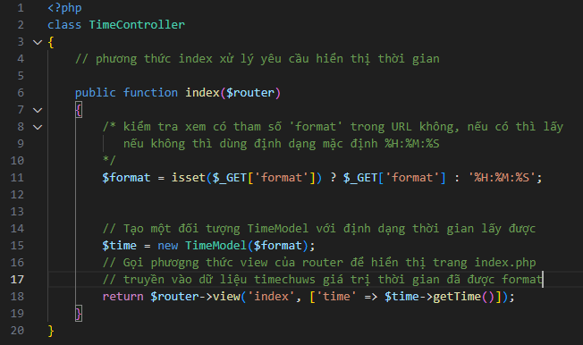
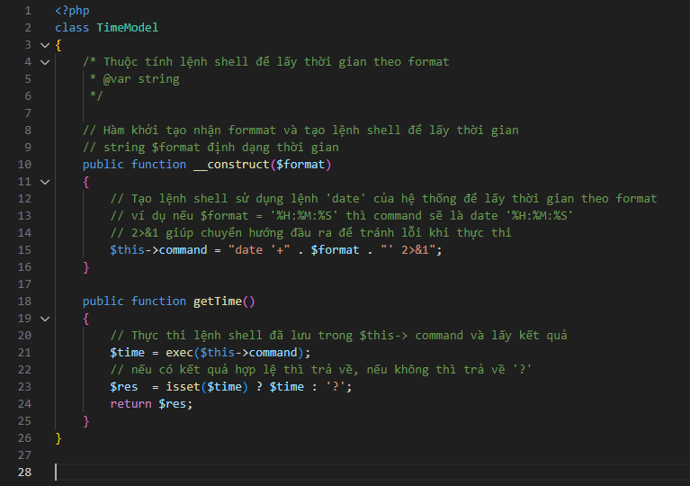
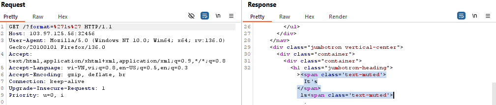
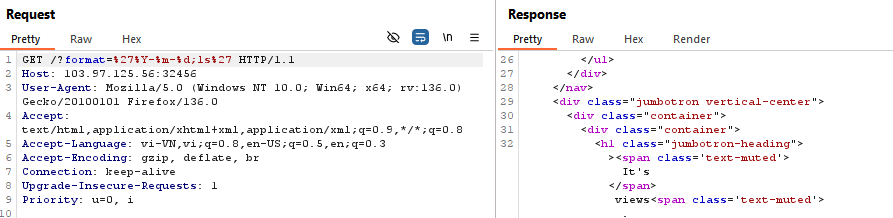

https://battle.cookiearena.org/challenges/web/time

1.	Phân tích file TimeController.php

2.	Phân tích file TimeModel.php

$this->command = "date '+" . $format . "' 2>&1" (code trong timemodel )
-	Các dấu nháy “ ‘ là để ghép chuỗi tạo thành một lệnh date hợp lệ 
cú pháp của lệnh date trên linux là : date '+<format>' 
dựa vào cú pháp trên thì ta sẽ bắt đầu thử chèn payload vào tham số format
3.	Bắt đầu lấy FLAG
-	Thử với payload : 'ls'

trả về luôn kí tự ls

-	Payload: '%Y-%m-%d;ls'

Đã chạy nhưng chỉ ra views

-	Theo cú pháp hợp lệ của lệnh date: date '+<format>'  thì ta nhận ra nhập vào format phải là một chuỗi thử với payload : '%Y-%m-%d;cat+/flag.txt' 

đã trả về giá trị flag 
