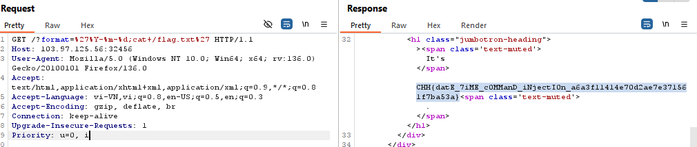
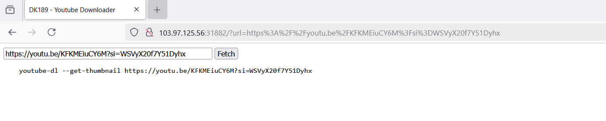
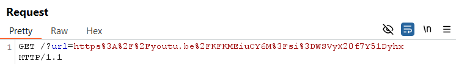
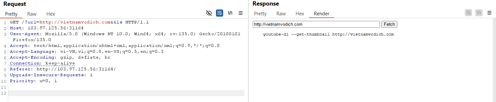
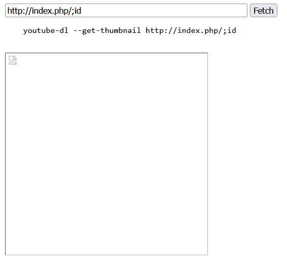
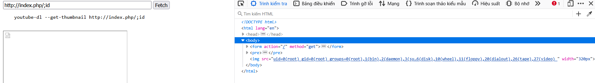
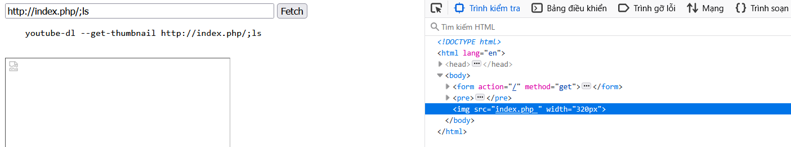
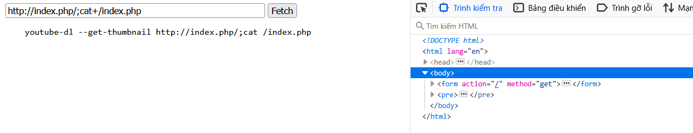
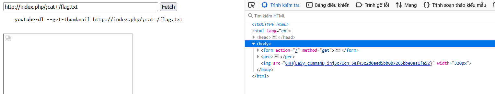

https://battle.cookiearena.org/challenges/web/youtube-downloader

- Kia là giao diện, đầu tiên ta nghĩ sẽ thử lệnh OPTIONS xem có những method nào cho phép
lệnh OPTIONS ko cho ta biết có bao nhiêu phương thức được cho phép, có vẻ đã bị ẩn 
Thử nhập một link youtube để xem ứng dụng trả về gì. 

- đã xuất hiện tham số url để nhập payload
- xuất hiện dòng     youtube-dl --get-thumbnail https://youtu.be/KFKMEiuCY6M?si=WSVyX20f7Y51Dyhx.
Sau khi thử nhiều lần với các link khác nhau kể cả không phải của youtube thì vẫn ra một dòng có cú pháp dạng:
  - youtube-dl --get-thumbnail <link nhập vào url>
  -  Vậy ta có thể chèn thêm 1 comment để thay vì nó thực thi lệnh https mà thực thi lệnh command?
Hay nó phải là một định dạng url 

- Nếu không phải là dạng url thì sẽ hiện ra    url is not valid!
- Giờ ta thử chèn thêm các ký tự ; hoặc | hoặc || hoặc && xem đầu vào đã được lọc chưa
  - với các kí tự ; hoặc | hoặc || hoặc > đều bị lọc 
  - với lệnh && thì lại ko hiển thị ra các file 

kí tự && sau khi thử thì ta nhận ra là nó sẽ hoạt động như 1 dấu comment 

- Bài này đã fill hết các dạng rồi nên ta sẽ phải bypass bằng payloadallthethings =)))
Ta thử chèn payload có dạng  /;id vào sau đường dẫn url rồi xem kết quả. Well có hình ảnh nhưng ko hiện gì cả 

- Chuột phải vào kiểm tra chọn console xem có gì nào =33

- Như vậy là đã tiêm được command vào shell rồi. Giờ ta sẽ thử với lệnh ls xem có file  flag.txt ko 

- File lại là index.php, ta sẽ thử lệnh cat với file này xem sao, payload: cat+/index.php

- Không có gì xảy ra, ta thử lệnh cat trực tiếp với file flag.txt luôn và được FLag

CHH{Ea5y_cOmmaND_inj3c7Ion_5ef45c2d0aed5bb0b7265bbe0ea1fe52}