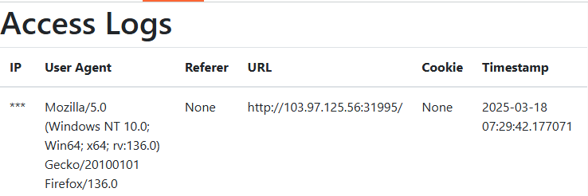
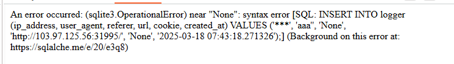
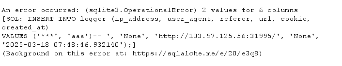
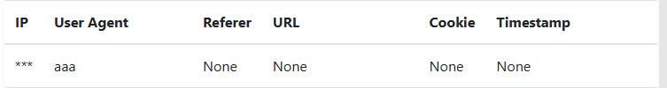
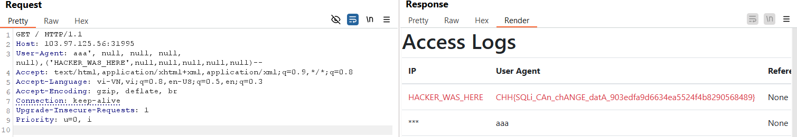

https://battle.cookiearena.org/challenges/web/baby-logger-middleware

1.	Thử với giá trị bình thường:

Trang web hoạt động bình thường

2. Thử với giá trị bất thường:

- Payload user agent: aaa’ 

Web validate với kí tự dấu nháy đơn

- Ta thấy gồm có 6 giá trị trả về và sử sqlite3 thiếu dấu ngoặc ) để hoàn thành 1 truy vấn
thử payload:
    - User-Agent: aaa')--  
    - được kết quả sau

- Web bảo là chỉ có 2 giá trị cho 6 cột tức là ta cần điền thêm cả 4 giá trị nữa payload 
  - User-Agent: aaa', null, null, null, null)-- 

- Đã truyền được tham số giờ ta cần hiển thị giá trị của ip để lấy flag nhưng mà ta chỉ điền được các giá trị header như user agent refer hay cookie. Vậy để chèn được thì ta tiếp tục nhập thêm 6 giá trị nữa tức payload sau:
  - User-Agent: aaa', null, null, null, null),('HACKER_WAS_HERE',null,null,null,null,null)-- 

Đã hiển thị nội dung flag=333

