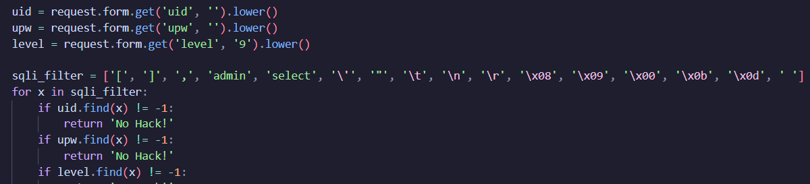
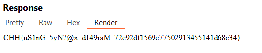

https://battle.cookiearena.org/challenges/web/baby-sqlite-with-filter

1.	Đánh giá

- Bài đã filter các giá trị cả admin với select hay cả các khoảng trắng và dấu nháy đơn, nháy kép nên ta cần một cách lấy giá trị khác ngoài câu truy vấn UNION SELECT
- Sau khi tìm hiểu trên sqlite.org trong câu lệnh truy vấn UNION còn có cách dùng với VALUES 
- VALUES sẽ tạo dữ liệu trực tiếp mà không cần SELECT từ bảng 
  - số lượng cột VALUES phải khớp với số lượng cột trong SELECT 
syntax VALUES
  - UNION VALUES (value1,value2,...)
- Câu truy vấn trong backend hoạt động như sau:
  - SELECT uid FROM users WHERE uid='{uid}' and upw='{upw}' and level={level}
- Trong giao diện web chỉ có 2 ô nhập  là uid và password nên ta sẽ dùng burpsuite để chèn giá trị  level nữa 

- Payload sẽ là 
  - &level=1/**/union/**/values/**/(char(97)||char(100)||char(109)||char(105)||char(110))
- Giải thích payload:
  - vì khoảng cách đã bị filter nên ta phải dùng comment /**/ để thay thế khoảng trắng
  - char() để chuyển mã ascii thành kí tự trong sqlite
  - || để nối các kí tự thành một chuỗi
  - và SELECT uid chỉ có một cột nên values ta cũng chỉ có một giá trị 
   

- Lúc này hệ thống sẽ thực hiện chuỗi truy vấn :
SELECT uid FROM users WHERE uid='1' AND upw='1' AND level=1 UNION VALUES ('admin');
