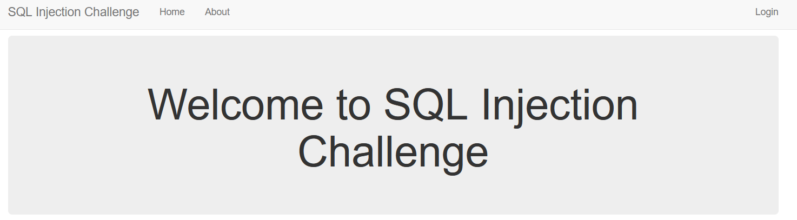

https://battle.cookiearena.org/challenges/web/simple-sql-injection-bypass-login

1.	Giao diện của bài lab

- kiểm tra chức năng login xem có hoạt động không?

có hoạt động

2.	Kiểm tra các kí tự bất thường

với dấu nháy kép vẫn hoạt động

dấu nháy đơn web đã validate, vậy ta sẽ dùng dấu nháy đơn để lấy thông tin từ bảng database

- Sử dụng payload: 
  - userid=admin" OR 1=1-- &userpassword=id

  - lúc này hệ thống sẽ thực hiện chuỗi truy vấn là:
SELECT FROM users WHERE userid=admin" OR 1=1-- &userpassword=id

Trả về kết quả hello guest

- Vậy phải làm sao để ta lấy thông tin của admin, lúc này ta sử dụng kĩ thuật phân trang với câu lệnh LIMIT để xác định xem các giá trị của từng dòng payload chèn vào lúc này sẽ là:
    - userid=guest" OR 1=1 LIMIT 0,1-- &userpassword=id
    - hệ thống sẽ chạy lệnh SELECT FROM users WHERE userid= guest" OR 1=1 LIMIT 0,1-- AND userpassword=id lúc này hệ thống sẽ trả về giá trị 1 cột từ cột số 0 vậy ta phải xem tiếp với giá trị LIMIT 1,1 và ta thấy xuất hiện giá trị flag

