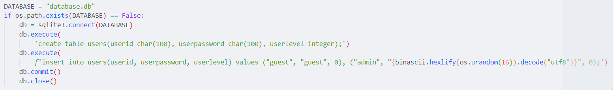
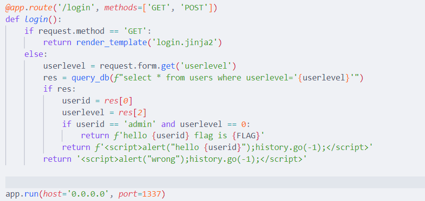
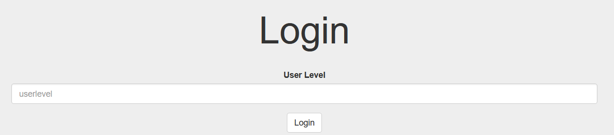
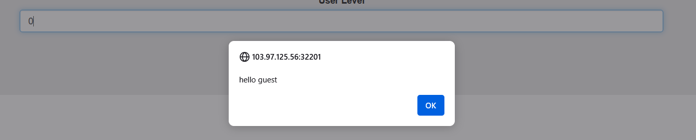
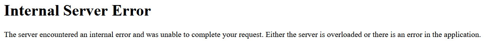
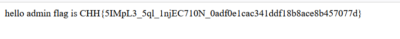

https://battle.cookiearena.org/challenges/web/simple-sqli

1.	Overview code:

- Tạo một bảng database có tên users gồm 3 cột userid, userpassword, userlevel
Thực hiện tạo giá trị guest và admin 

- Thực hiện truy vấn: SELECT * FROM users WHERE userlevel='userlevel'

2. Thực hiện lấy Flag:
-	Chuỗi truy vấn sẽ được chèn vào giá trị userlevel

-	Thử với giá trị 0:

-	Thử với giá trị bất thường: 0'

Web đã validate giá trị nên ta có thể tiêm sql 

-	Payload: ' UNION SELECT 'admin', 'password', 0--

