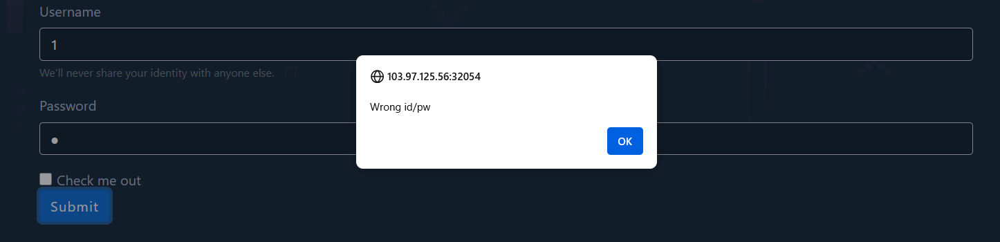

https://battle.cookiearena.org/challenges/web/sql-injection-bypass-login

- Giao diện của web:

1.	Thử với giá trị bình thường xem chức năng login có hoạt động không

- Ta nhập username=1 và password=1

Chức năng bình thường

2.	Thử với giá trị bất bình thường xem web có validate kí tự không

- Ta nhập username=1’ và pasword = 1

Web phản ứng với kí tự ‘ 

- Thử tiếp với kí tự “  

Vậy ta sẽ dùng ‘ để SQL injection 

- Payload: username=guest' OR 1=1-- &password=guest  
  

Lấy được Flag