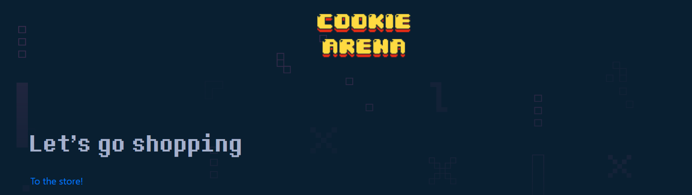
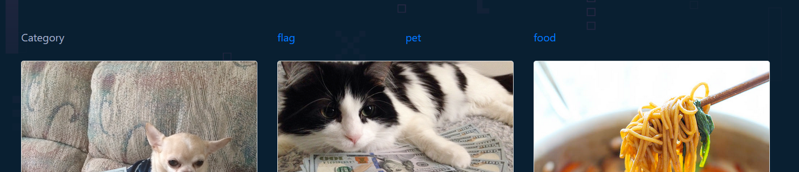
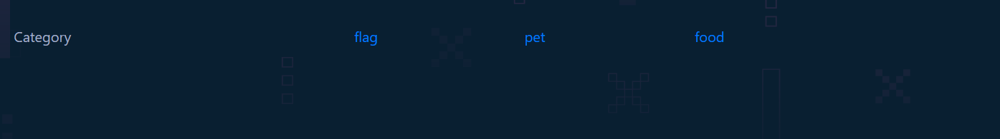
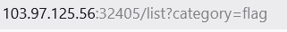
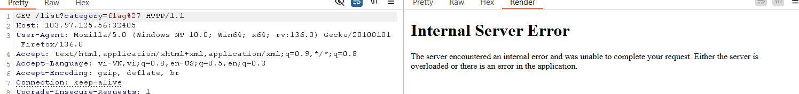
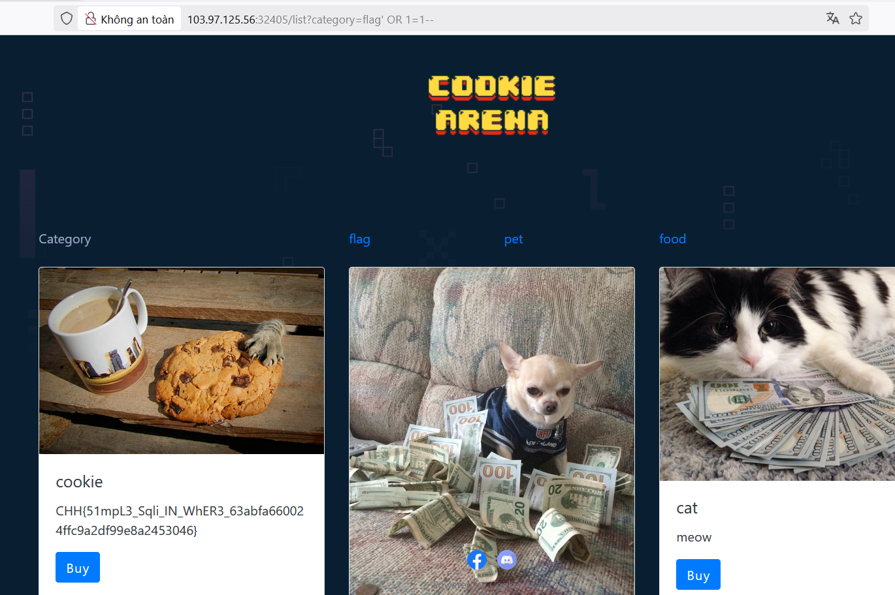

https://battle.cookiearena.org/challenges/web/sql-injection-vulnerability-in-where-clause

- Giao diện web:

-	Chọn to the store ta sẽ ra 1 dao diện chứa các mục gồm category, flag, food, pet

-	Chọn thử mục flag:

- Không có gì xảy ra vậy flag đã bị ẩn và ko trả về nhưng quan sát trong chuỗi truy vấn ta thấy có  tức giá có thể chèn sql vào 
-  Thử với payload: flag'

xác nhận web validate với kí tự đặc biệt

- Thử với payload flag' OR 1=1--  	mục đích để hiển thị toàn bộ nội dung trả về trong bảng flag
- 

Có giá tị flag trả về r